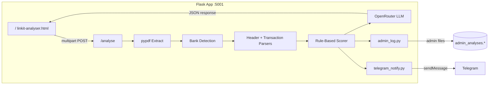

# Linkit Fundability Analyser

**AI-powered UAE bank statement analysis for SME funding readiness.**

Upload a digital business bank statement PDF, enter your AECB credit score and months in business, and receive a **0–100 fundability score** with lender-style metrics, AI-generated observations, and a printable PDF summary — in seconds.

Built for [Linkit](https://letslinkit.com) to help UAE SMEs understand how lenders are likely to view their banking profile before they apply for finance.

---

## Table of Contents

- [Overview](#overview)
- [Features](#features)
- [Architecture](#architecture)
- [Project Structure](#project-structure)
- [Requirements](#requirements)
- [Installation & Setup](#installation--setup)
- [Configuration](#configuration)
- [Usage](#usage)
- [API Reference](#api-reference)
- [Supported Banks](#supported-banks)
- [Scoring Model](#scoring-model)
- [Admin Logging](#admin-logging)
- [Privacy & Data Boundaries](#privacy--data-boundaries)
- [Limitations](#limitations)
- [Troubleshooting](#troubleshooting)

---

## Overview

The Fundability Analyser is a lightweight full-stack tool consisting of:

| Layer | Technology |
|-------|------------|
| **Frontend** | Single-page HTML/CSS/JS — served by Flask at `/` |
| **Backend** | Python · Flask · Flask-CORS |
| **PDF extraction** | `pypdf` + bank-specific regex parsers |
| **Scoring** | Deterministic rule-based model (no LLM) |
| **Narrative layer** | OpenRouter LLM with model routing & fallbacks |

The pipeline extracts transaction-level signals from UAE bank statements, computes a weighted fundability score aligned with common lender thresholds, and uses an LLM to produce a diplomatic verdict and four factual observations. Company names extracted from statements are **admin-only** and never exposed to the end user.

---

## Features

### Statement parsing
- Multi-bank UAE support: **ADCB**, **Emirates NBD**, **RAKBank**, **Wio Bank**, **Mashreq**, plus a **generic fallback** for other UAE banks
- Wio multi-currency section handling (AED-primary scoring)
- Cheque bounce detection with fee-line exclusion
- Cash deposit (CDM) mix, ATM withdrawals, unique payer diversity, and personal-spend flag counting

### Fundability scoring
- Transparent 0–100 score derived from nine weighted signals
- Score clamped between 5 and 95
- Verdict bands: **Strong** (≥70), **Moderate** (≥45), **Needs Work** (<45)

### User experience
- Drag-and-drop PDF upload
- Animated score ring and progress bar
- Key metrics grid with status badges
- Financial health overview with AI observations
- **Export Analysis (PDF)** — single-page grayscale print report with SVG score bar
- Consultation CTAs linking to [Calendly](https://calendly.com/letslinkit-to-abhinav)

### Operations
- Structured admin audit trail (JSON, JSONL, and human-readable log)
- Telegram notifications on successful analysis (optional)
- OpenRouter key rotation with rate limiting
- Rule-based LLM fallback when the API is unavailable

---

## Architecture



**Request flow**

1. User enters name, phone, AECB score, and months in business; uploads PDF.
2. Backend extracts text per page; rejects scanned/image-only PDFs.
3. Bank is detected; the matching parser extracts header balances and transaction blocks.
4. Transaction scanner computes risk metrics (bounces, cash mix, ATM, payers, etc.).
5. `compute_score()` applies weighted rules → numeric score.
6. LLM receives **aggregated public metrics only** → verdict, summary, four points.
7. Company profile and lead details are logged server-side; Telegram alert is sent if configured.
8. Frontend renders results and offers PDF export via browser print.

---

## Project Structure

```
Bank-Statement-Analyser/
├── backend.py              # Flask app, parsers, scoring, /analyse endpoint
├── llm.py                  # OpenRouter client, rate limiting, model routing
├── admin_log.py            # Admin audit trail (JSON / JSONL / tabular log)
├── telegram_notify.py      # Telegram lead notifications on successful analysis
├── model_routing.json      # LLM model selection per role
├── linkit-analyser.html    # Frontend UI
├── assets/
│   └── linkit-logo.png     # Linkit brand asset
├── .env.example            # Environment variable template
└── README.md
```

Generated at runtime (gitignored):

```
admin_analyses.json      # Formatted JSON array of all analyses
admin_analyses.jsonl     # One JSON object per line
admin_analyses.log       # Human-readable tabular report
```

---

## Requirements

- **Python** 3.10+
- **Modern browser** (Chrome, Safari, Firefox, Edge)
- **OpenRouter API key(s)** for AI observations (optional — rule fallback applies)
- **Digital bank statement PDFs** with selectable text (not scanned images)

---

## Installation & Setup

### 1. Clone the repository

```bash
git clone https://github.com/westernmonkey/Bank-Statement-analyser-MVP.git
cd Bank-Statement-analyser-MVP
```

### 2. Install Python dependencies

```bash
pip install flask flask-cors pypdf httpx python-dotenv python-dateutil
```

### 3. Configure environment variables

```bash
cp .env.example .env
```

Edit `.env` and add your OpenRouter keys:

```env
OR_KEY_1=sk-or-v1-...
OR_KEY_2=sk-or-v1-...
# Up to OR_KEY_5 supported for rotation
```

### 4. Start the app

```bash
python backend.py
```

Open **http://localhost:5001** in your browser. Flask serves the UI and the `/analyse` API on the same port.

---

## Configuration

### OpenRouter keys

| Variable | Description |
|----------|-------------|
| `OR_KEY_1` … `OR_KEY_5` | OpenRouter API keys (rotated on failure) |

### Rate limiting (optional)

| Variable | Default | Description |
|----------|---------|-------------|
| `OR_MAX_REQUESTS_PER_MINUTE` | `8` | Max calls per minute |
| `OR_MAX_REQUESTS_PER_RUN` | `20` | Max calls per process lifetime |
| `OR_MIN_REQUEST_INTERVAL_SECONDS` | `2` | Minimum gap between requests |
| `OR_RETRY_DELAY_SECONDS` | `10` | Delay before retrying a failed key |
| `OR_MAX_RETRIES_PER_KEY` | `3` | Retries per key before rotation |

### Model routing

Edit `model_routing.json` to change the LLM used for narrative generation:

```json
{
  "analyser": "openai/gpt-oss-120b:free"
}
```

Fallback chain: configured model → `openrouter/free` → rule-based text fallback.

### Telegram notifications (optional)

On every successful analysis, the backend sends a formatted text summary to your Telegram chat (lead info, company from PDF, score, metrics, AI observations). Failures are logged and never block the user response.

| Variable | Description |
|----------|-------------|
| `TELEGRAM_BOT_TOKEN` | Bot token from [@BotFather](https://t.me/BotFather) |
| `TELEGRAM_CHAT_ID` | Destination chat ID (e.g. `531306519`) |

If either variable is unset, notifications are skipped silently.

---

## Usage

1. Enter your **name**, **phone number**, **AECB credit score** (300–900), and **months in business**.
2. Upload a **digital PDF** bank statement (any supported UAE bank).
3. Click **Analyse My Statement**.
4. Review your fundability score, metrics, and AI observations.
5. Optionally **Export Analysis (PDF)** — use your browser’s print dialog and choose *Save as PDF*. Enable **Background graphics** for the score bar and table shading.

---

## API Reference

### `POST /analyse`

Analyse a bank statement and return a fundability assessment.

**Content-Type:** `multipart/form-data`

| Field | Type | Required | Description |
|-------|------|----------|-------------|
| `pdf` | file | Yes | Bank statement PDF |
| `name` | string | No | Contact name (sent to Telegram admin alert) |
| `phone` | string | No | Contact phone (sent to Telegram admin alert) |
| `aecb` | integer | Yes | AECB credit score (300–900) |
| `months` | integer | Yes | Months in business (≥1) |

**Success response** `200`

```json
{
  "score": 82,
  "verdict": "Strong",
  "sub": "Revenue and credit quality well above thresholds",
  "points": [
    "Avg monthly revenue 632,013 AED exceeds strong threshold.",
    "AECB score of 800 is comfortably above the strong benchmark.",
    "Business age of 23 months falls into the borderline range.",
    "Cheque bounces total 0 with cash deposits at 17% of inflows."
  ],
  "metrics": {
    "bank": "Emirates NBD",
    "aecb": 800,
    "months_in_business": 23,
    "avg_monthly_revenue": 632013,
    "closing_balance": 397285,
    "opening_balance": 120000,
    "total_credits_6m": 3792078,
    "total_debits_6m": 3514793,
    "num_credit_txns": 18,
    "num_debit_txns": 142,
    "period_months": 6,
    "cash_deposit_pct": 17,
    "cheque_bounces": 0,
    "atm_withdrawals": 2,
    "unique_inflow_sources": 5,
    "personal_spend_flags": 12
  },
  "model_used": "openai/gpt-oss-120b:free"
}
```

**Error response** `400` / `500`

```json
{
  "error": "Human-readable error message."
}
```

Common errors:

| Message | Cause |
|---------|-------|
| Scanned/image PDF | PDF has no selectable text |
| Could not extract financial data | Unrecognised or incomplete statement |
| Password protected | Encrypted PDF |
| AECB out of range | Score not between 300 and 900 |

---

## Supported Banks

| Bank | Parser ID | Header extraction | Transaction format |
|------|-----------|-------------------|-------------------|
| ADCB (detailed export) | `adcb_detailed` | Total credits/debits, opening/closing balance | Sr.No + date columns |
| ADCB (legacy) | `adcb_legacy` | Computed from transactions + statement period | DD/MM/YYYY multiline rows |
| Emirates NBD | `enbd` | Computed from transactions + carried-forward balance | `DDMMMYY` date prefix |
| RAKBank | `rak` | Total deposits/withdrawals, opening/closing balance | `DD-MMM-YYYY` rows |
| Wio Bank | `wio` | Opening/closing balance, multi-currency sections | Date + reference + signed amount |
| Mashreq | `mashreq` | Bank-specific header patterns | Standard UAE row patterns |
| Other UAE banks | `generic` | Inferred from balance/credit keywords | Generic line-joined blocks |

> **Note:** Statements must be **digital PDFs** exported from online banking. Scanned or photographed statements will be rejected.

---

## Scoring Model

The score starts at **50** and is adjusted by nine signals. The final value is clamped to **5–95**.

| Signal | Strong (+) | Weak (−) |
|--------|------------|----------|
| **AECB score** | ≥660 → +15 · ≥600 → +5 | <600 → −15 |
| **Monthly revenue (AED)** | ≥500K → +15 · ≥100K → +7 | <30K → −10 |
| **Time in business** | ≥36 mo → +10 · ≥6 mo → +3 | <6 mo → −10 |
| **Closing balance** | ≥50K → +5 · ≥10K → +2 | <10K → −5 |
| **Cheque bounces** | 0 (no bonus) | −8 each, max −24 |
| **Cash deposit %** | ≤20% (no penalty) | >40% → −10 · >20% → −4 |
| **ATM withdrawals** | 0 (no penalty) | >15 → −6 · >8 → −3 |
| **Personal spend flags** | ≤15 (no penalty) | >80 → −8 · >40 → −4 · >15 → −2 |
| **Unique inflow sources** | ≥10 → +8 · ≥5 → +4 · ≥3 → +2 | <3 → −5 |

Verdict mapping:

| Score | Verdict |
|-------|---------|
| ≥ 70 | Strong |
| 45–69 | Moderate |
| < 45 | Needs Work |

---

## Admin Logging

Every successful `/analyse` request appends a record to three gitignored files:

| File | Format | Purpose |
|------|--------|---------|
| `admin_analyses.json` | Indented JSON array | Structured review with `metrics_table`, `score`, `company`, `source` |
| `admin_analyses.jsonl` | JSON Lines | Machine-readable stream, one object per analysis |
| `admin_analyses.log` | Fixed-width text | Human-readable tabular report for quick scanning |

**Example JSON structure:**

```json
{
  "timestamp": "2026-06-17T12:00:00+00:00",
  "source": { "filename": "statement.pdf", "bank": "RAKBank", "parser": "rak" },
  "company": { "name": "Example Trading LLC", "address": ["Dubai, UAE"] },
  "inputs": { "aecb": 678, "months_in_business": 23 },
  "score": { "value": 88, "verdict": "Strong", "summary": "..." },
  "metrics_table": [
    { "metric": "Avg monthly revenue", "value": 7335160, "display": "AED 7,335,160" }
  ],
  "observations": ["..."],
  "model": "openai/gpt-oss-120b:free"
}
```

---

## Privacy & Data Boundaries

| Data | User-facing API / UI | Admin log |
|------|---------------------|-----------|
| Fundability score & metrics | Yes | Yes |
| AI verdict & observations | Yes | Yes |
| Company name & address | **No** | Yes |
| Source filename | **No** | Yes |
| Personal spend / PUR flags | Used in scoring only | Yes (metrics) |
| Raw transaction text | **No** | **No** |

- AECB score and months in business are **user-provided** — never inferred from the PDF.
- The LLM receives **aggregated public metrics only**; sensitive internal flags are excluded from prompts and user-facing copy.
- Admin log files should be treated as **confidential** and are excluded from version control.

---

## Limitations

- **Indicative only** — not a credit decision, guarantee of funding, or regulated credit assessment.
- Requires **selectable-text PDFs**; OCR for scanned statements is not supported.
- Parser accuracy depends on statement format consistency; newly changed bank layouts may need parser updates.
- LLM observations are generated from summary metrics and may require human review.
- Free-tier OpenRouter models are subject to rate limits and availability.

---

## Troubleshooting

| Issue | Solution |
|-------|----------|
| `Failed to fetch` / CORS error | Ensure `python backend.py` is running and you opened http://localhost:5001 |
| Empty PDF export | Hard-refresh the page; allow pop-ups; enable **Background graphics** in print |
| `No selectable text` error | Re-export a digital PDF from your bank’s online portal |
| LLM returns generic fallback text | Check `.env` keys; review OpenRouter rate limits |
| Wrong bank detected | Generic parser still runs; check admin log `parser` field |
| Score seems off | Verify statement period covers expected months; check admin `metrics_table` |

---

## License

Internal tool developed for Linkit. Contact the repository owner for usage terms outside the Linkit organisation.

---

<p align="center">
  <a href="https://letslinkit.com">letslinkit.com</a> ·
  <a href="https://calendly.com/letslinkit-to-abhinav">Book a consultation</a>
</p>
